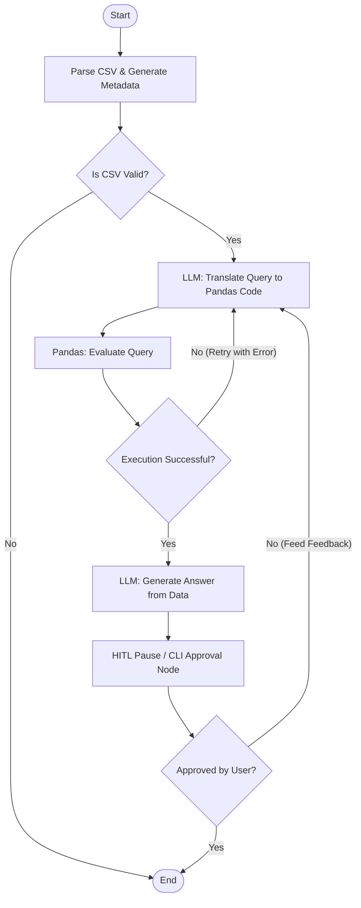

# Modular CSV Analysis AI Agent

A modular, PEP-8 compliant Python 3.11 AI Agent built with **LangChain**, **LangGraph**, **Pandas**, **Ragas**, and **Pytest**. This agent allows users to query tabular data (CSV format) using local open-source LLMs (via Ollama) and features a self-correcting query execution mechanism with a CLI Human-in-the-Loop (HITL) approval step.

---

## 1. Project Architecture

The agent uses a StateGraph to parse the CSV, generate Python Pandas expressions, execute those queries on the local environment, draft answers, and await human validation before finalizing responses.



### Component Structure
- `agent/llm.py`: Configures the local `ChatOllama` LLM and `OllamaEmbeddings` wrapper.
- `agent/parser.py`: CSV file loader and structural schema generation utilities using Pandas.
- `agent/state.py`: Defines the `AgentState` containing the message context, metadata, error details, and user verification flags.
- `agent/nodes.py`: The executable code blocks (nodes) mapping to each graph step.
- `agent/graph.py`: Defines workflow routing rules, compiles nodes, and schedules checkpoint limits.
- `main.py`: Interactive command-line application managing state restoration and validation feedback.
- `evaluate.py`: Performance testing suite running faithfulness and answer relevance evaluations via Ragas.

---

## 2. Prerequisites & Local LLM Setup

To use local inference, you need to run [Ollama](https://ollama.com/) on your host machine.

1. **Install Ollama**: Follow instructions on [ollama.com](https://ollama.com/).
2. **Download LLM & Embedding Models**:
   ```bash
   ollama pull llama3
   ollama pull nomic-embed-text
   ```
3. **Run Ollama Service**: Ensure the Ollama server is running (defaults to `http://localhost:11434`).

---

## 3. Installation & Setup

### Local Installation
1. Create a virtual environment:
   ```bash
   python -m venv .venv
   source .venv/bin/activate  # On Windows: .venv\Scripts\activate
   ```
2. Install dependencies:
   ```bash
   pip install --upgrade pip
   pip install -r requirements.txt
   ```

---

## 4. How to Run

Use `main.py` to query your CSV files. Pass the path to your CSV and your question:

```bash
python main.py --csv data/sample.csv --query "What is the average salary of employees in Engineering?"
```

### Human-in-the-Loop CLI Flow
1. The agent compiles data metadata and executes a pandas query.
2. The agent pauses before output and presents:
   - Generated Pandas query
   - Extracted data subset
   - Drafted response
3. Prompt: `Approve this response? [y/n]: `
   - Enter `y` to finalize.
   - Enter `n` to reject and supply instructions (e.g. *"Look at George too, his salary is 110000"*). The agent self-corrects and drafts a new answer.

### Auto-Approve Mode (for automation)
Pass `--auto-approve` or set `AUTO_APPROVE=true` in the environment to skip manual approval:
```bash
python main.py --csv data/sample.csv --query "What is the average salary of employees in Engineering?" --auto-approve
```

### Web Application Interface
Alternatively, you can run the interactive web application, which features a graphical timeline of LangGraph node executions and a user-friendly Human-in-the-Loop approval dashboard:

1. **Start the Web Server**:
   ```bash
   python3 -m uvicorn app:app --reload --port 8000
   ```
2. **Access the Application**: Open [http://localhost:8000](http://localhost:8000) in your web browser.
3. **Web Features**:
   - **File Upload Zone**: Drag-and-drop your CSV file directly to upload.
   - **Tabular Data Preview**: View the first 10 rows and dataset dimensions directly in the UI.
   - **Workflow Tracker**: Watch the active node light up as the agent works (CSV Parsing -> Query Translation -> Data Extraction -> Draft Answer -> Validation).
   - **Interactive Validation Dashboard**: When paused at the validation node, inspect the generated Pandas code, raw data subset, and drafted response. Approve it or submit feedback to trigger a refinement cycle.

---


## 5. Evaluation with Ragas

`evaluate.py` verifies the agent response accuracy against ground truths using the `ragas` library metrics (*faithfulness* and *answer_relevance*):

```bash
python evaluate.py
```
*Note: This runs in auto-approve mode, generates agent answers for a test set based on `data/sample.csv`, scores them using local Ollama models, and outputs a detailed `evaluation_results.csv`.*

---

## 6. Running Tests

We use Pytest to run tests. LLM calls are mocked to allow execution without a live Ollama connection.

Run tests with:
```bash
pytest -v
```

---

## 7. Run with Docker

You can build and package the application into a Docker container.

### 1. Build the Docker Image
```bash
docker build -t csv-ai-agent .
```

### 2. Run the Container
Because Ollama is running on the host machine, use `--network="host"` or set `OLLAMA_BASE_URL` to point to the host IP:

**Linux / macOS (Host network):**
```bash
docker run --network="host" -it csv-ai-agent --csv data/sample.csv --query "Who is the oldest employee?"
```

**Windows / macOS (Docker Desktop):**
```bash
docker run -e OLLAMA_BASE_URL=http://host.docker.internal:11434 -it csv-ai-agent --csv data/sample.csv --query "Who is the oldest employee?"
```

---

## 8. Push to a Public GitHub Repository

Run these commands to commit your local repository and push it to GitHub:

```bash
# Add all files to staging
git add .

# Commit changes
git commit -m "feat: initial commit of modular CSV AI agent"

# Create a new main branch (if not already set)
git branch -M main

# Link to your remote GitHub repository
git remote add origin https://github.com/<your-username>/<your-repo-name>.git

# Push changes to GitHub
git push -u origin main
```
